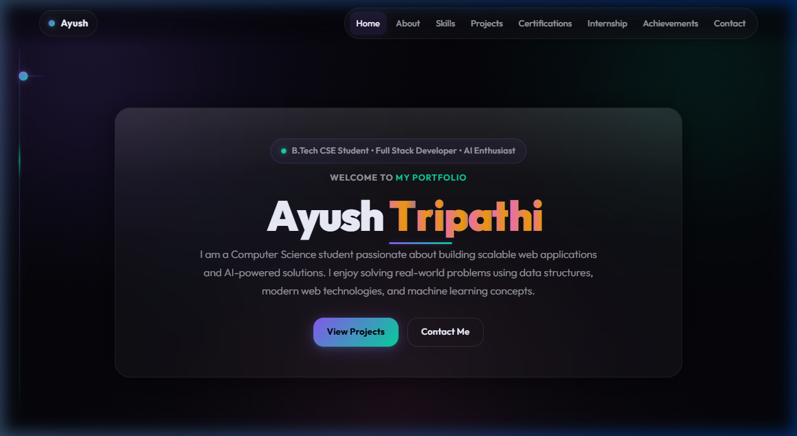
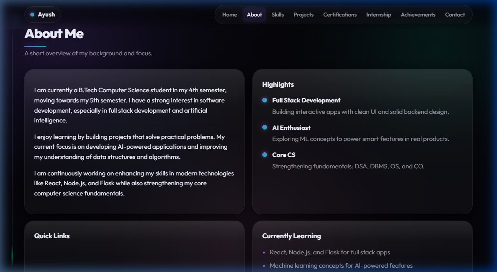
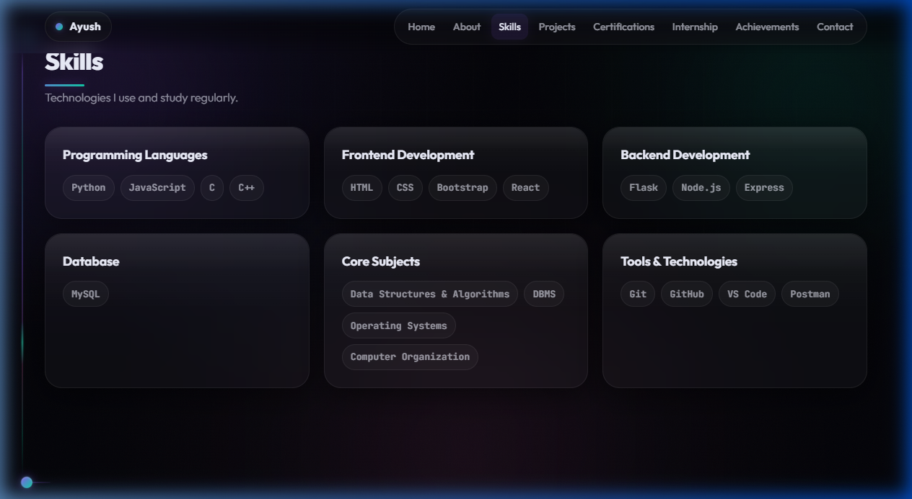
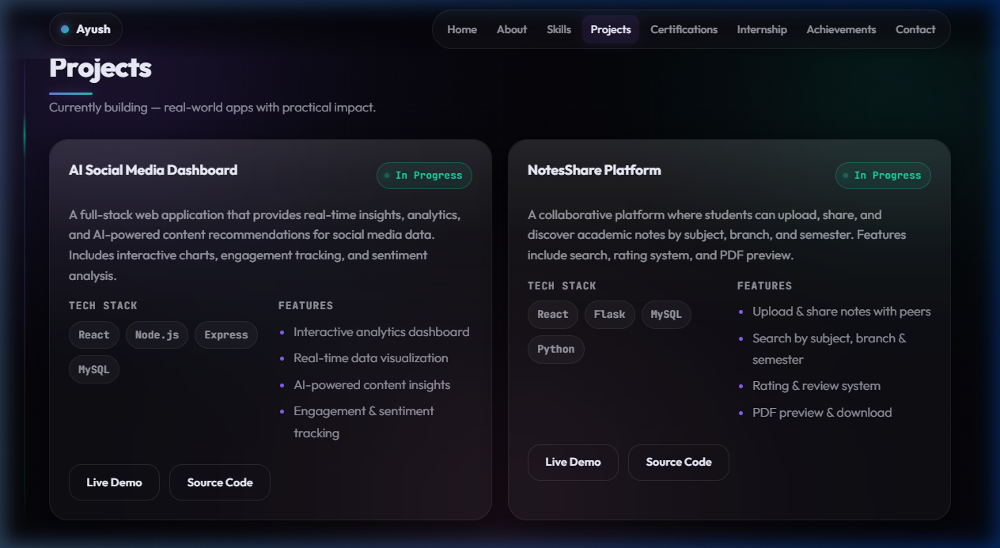
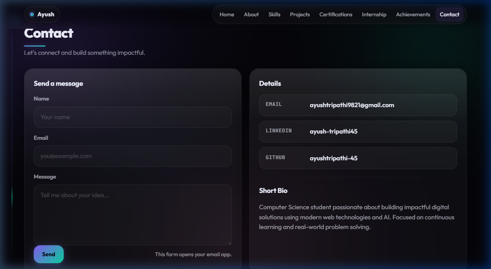

<p align="center">
  
</p>

<p align="center">
  
  
  
  
  
</p>

<p align="center">
  <b>A modern, dark-themed developer portfolio with glassmorphism UI, animated text effects, vine-connected sections, and neon accents.</b>
</p>

<p align="center">
  <a href="https://ayushtripathi-45.github.io/My-Portfolio-Basic-Version-/">🌐 Live Demo</a> •
  <a href="#-screenshots">📸 Screenshots</a> •
  <a href="#-features">✨ Features</a> •
  <a href="#-tech-stack">🛠 Tech Stack</a>
</p>

---

## 👤 About Me

| | |
|---|---|
| **Name** | Ayush Tripathi |
| **Education** | B.Tech CSE (4th → 5th Semester) |
| **Focus** | Full Stack Development • AI/ML • DSA |
| **Email** | ayushtripathi9821@gmail.com |
| **LinkedIn** | [ayush-tripathi45](https://linkedin.com/in/ayush-tripathi45) |
| **GitHub** | [ayushtripathi-45](https://github.com/ayushtripathi-45) |

---
## 📸 Demo


https://github.com/user-attachments/assets/36ba962d-155d-4031-a88a-5514bfa9201d

---

## 📸 Screenshots

### 🏠 Hero Section
> Animated letter-by-letter title reveal, rainbow gradient shimmer on name, typing effect, and glassmorphism card.



### 👨‍💻 About & Skills
> Timeline highlights, quick links, and skill tags organized by category with hover glow effects.

| About | Skills |
|---|---|
|  |  |

### 🚀 Projects
> Two active projects displayed side-by-side with "In Progress" status indicators, tech stacks, and feature lists.



### 📬 Contact
> Contact form with neon-focused inputs, contact details with hover animations, and a short bio.



---
    
## ✨ Features

### 🎨 Design
- **Dark Glossy Theme** — Deep black (#030308) base with glass-morphism cards
- **Neon Accent Palette** — Electric violet, emerald cyan, and soft rose
- **Glossy Sheen** — Top-highlight gradient on every card for a premium material feel
- **Animated Gradient Borders** — Conic gradient border glow on hover using `::after` pseudo-element

### 🎬 Animations
- **Letter-by-letter Hero Title** — 3D rotate + translate reveal with staggered delays
- **Rainbow Shimmer Name** — Multi-color gradient scrolling across "Tripathi"
- **Word-by-word Subtitle** — Sequential fade-in for the hero description
- **Section Title Scroll Reveal** — Letters animate into view as you scroll
- **Typing Effect** — "my portfolio" types itself with a blinking neon cursor
- **Scroll Reveal Cards** — Glass cards fade up with staggered sibling delays
- **Cursor Glow** — Subtle violet radial gradient follows your mouse (desktop)

### 🌿 Vine / Stem Connector
- **Vertical Stem** — Neon gradient line on the left linking all sections
- **Leaf Nodes** — Glowing dots at each section like leaves on a vine
- **Branch Lines** — Connecting branches extend from stem to section
- **Flowing Particle** — Animated light travels down the stem
- **Interactive** — Nodes grow and branches extend on section hover

### ⚙️ Functionality
- **Scroll Spy** — Active nav link highlights based on visible section
- **Certificate Manager** — Upload, save (localStorage), preview, and delete certificates
- **Contact Form** — Opens email client with pre-filled subject & body
- **Mobile Responsive** — Full hamburger nav, stacked grids, adapted spacing
- **Accessibility** — Skip link, ARIA labels, `prefers-reduced-motion` support

---

## 🛠 Tech Stack

| Technology | Purpose |
|---|---|
|  | Semantic structure, SEO meta tags |
|  | Glassmorphism, animations, responsive design |
|  | DOM manipulation, IntersectionObserver, localStorage |
|  | Outfit (headings/body) + JetBrains Mono (code/labels) |

**No frameworks. No build tools. Pure HTML + CSS + JS.** 🔥

---

## 📂 Folder Structure

```
My-Portfolio-Basic-Version-/
│
├── index.html          # Main HTML — all sections (hero, about, skills, projects, etc.)
├── styles.css          # Complete CSS — dark glossy theme, animations, responsive
├── script.js           # JavaScript — text animations, scroll spy, certifications, cursor glow
├── screenshots/        # Portfolio screenshots for README
│   ├── hero.png
│   ├── about.png
│   ├── skills.png
│   ├── projects.png
│   └── contact.png
└── README.md           # This file
```

---

## 🚀 Current Projects

### 1. AI Social Media Dashboard `🟢 In Progress`
> A full-stack web application providing real-time insights, analytics, and AI-powered content recommendations for social media data.

| Key | Detail |
|---|---|
| **Stack** | React, Node.js, Express, MySQL |
| **Features** | Interactive analytics, real-time data viz, AI content insights, sentiment tracking |

### 2. NotesShare Platform `🟢 In Progress`
> A collaborative platform where students can upload, share, and discover academic notes by subject, branch, and semester.

| Key | Detail |
|---|---|
| **Stack** | HTML, CSS, Bootstrap, React, Node.js, Express, MongoDB, JWT |
| **Features** | Upload & share notes, search by subject/branch/semester, rating system, PDF preview, JWT authentication |

---

## 🔮 Future Enhancements

| Enhancement | Description |
|---|---|
| 🌙 **Light/Dark Toggle** | Add theme switcher with smooth transition between light and dark modes |
| 📊 **GitHub Stats Widget** | Embed live GitHub contribution graph and repo stats |
| 📝 **Blog Section** | Add a blog/articles section to share technical writing |
| 🎨 **Project Screenshots** | Add visual previews and demo GIFs for each project |
| 📱 **PWA Support** | Service worker + manifest for installable web app |
| 🔗 **Live Project Links** | Connect live demo and source code buttons once projects are deployed |
| 🏆 **Dynamic Achievements** | Pull LeetCode/HackerRank stats dynamically via API |
| 📄 **Resume Download** | Add downloadable PDF resume button |
| 💬 **Testimonials** | Section for recommendations and endorsements |
| 🌐 **Custom Domain** | Set up a custom domain (e.g., ayushtripathi.dev) |

---

## 🖥 Run Locally

```bash
# Clone the repo
git clone https://github.com/ayushtripathi-45/My-Portfolio-Basic-Version-.git

# Navigate to the folder
cd My-Portfolio-Basic-Version-

# Open in browser (no build needed!)
# Option 1: Just double-click index.html
# Option 2: Use a local server
npx serve .
```

---

## 🤝 Contributing

Contributions, issues, and feature requests are welcome!

1. Fork the repository
2. Create a new branch (`git checkout -b feature/awesome-feature`)
3. Commit your changes (`git commit -m 'Add awesome feature'`)
4. Push to the branch (`git push origin feature/awesome-feature`)
5. Open a Pull Request

---

## 📜 License

This project is open source and available under the [MIT License](LICENSE).

---

<p align="center">
  <b>⭐ If you like this portfolio, give it a star!</b>
</p>

<p align="center">
  Made with 💜 by <a href="https://github.com/ayushtripathi-45">Ayush Tripathi</a>
</p>

<p align="center">
  <sub>🤖 This portfolio was designed & developed with the assistance of AI models.</sub>
</p>
